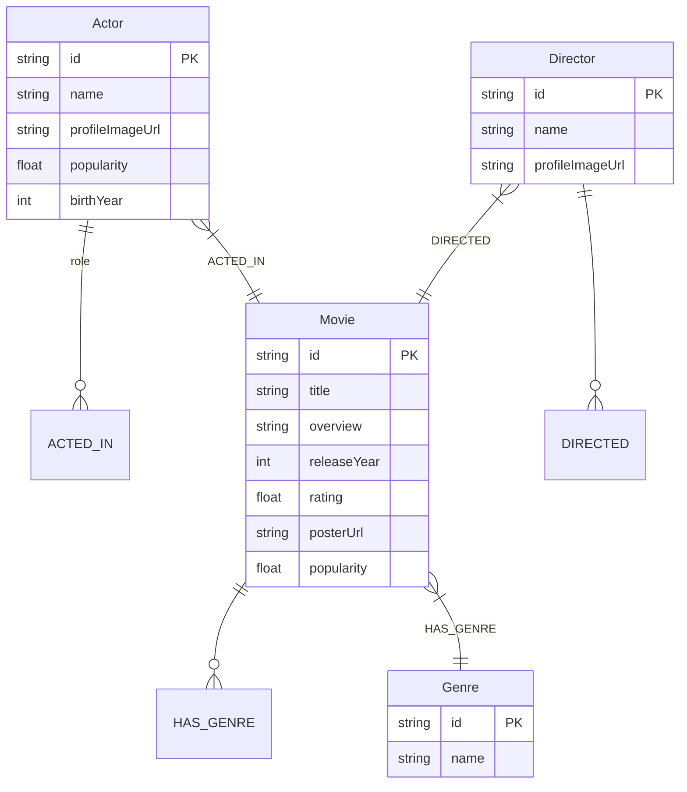

# MovieGraph — Actor & Movie Relationship Explorer

> *"Discover the connections behind the movies you love."*

MovieGraph is a full-stack web application designed to showcase graph data modeling, multi-hop Cypher query traversals, clean layered architecture, and interactive network visualization. It is backed by **CognoDB** (speaking openCypher over the Bolt protocol via the official Neo4j JavaScript driver) and seeded with real TMDB cinema data.

---

## 🎬 Demo

<video src="MovieGraph-Demo.mp4" width="100%" controls autoplay muted loop>
  Your browser does not support the video tag.
</video>

---

## ⚡ Why a Graph Database? (SQL vs. openCypher)

This application has three core features. Every single one of them is a **relationship-first problem** — and that is exactly where relational databases break down and graph databases thrive.

### The Fundamental Problem with SQL for Relationship Queries

A relational database stores data in flat tables. Relationships between entities are represented as foreign keys and junction tables. To answer a question like *"find the shortest connection between two actors through shared movies"*, SQL must perform **recursive self-joins** — joining a table against itself multiple times, once per hop. Each additional degree of separation multiplies the query complexity exponentially.

This is not a query-writing problem. It is a **data model mismatch**. SQL was designed for aggregating rows, not traversing networks.

---

### Feature-by-Feature Comparison

#### Feature 1 — Degrees of Separation (Shortest Path)

Finding the shortest path between two actors through shared movies is a classic graph traversal problem. In SQL this requires a recursive CTE (Common Table Expression) that re-joins the cast table at every depth level:

```sql
-- SQL: Recursive shortest path — grows exponentially with depth
WITH RECURSIVE path AS (
  SELECT actor_id, movie_id, ARRAY[actor_id] AS visited, 1 AS depth
  FROM cast_members WHERE actor_id = 'a6193'
  UNION ALL
  SELECT c.actor_id, c.movie_id, visited || c.actor_id, depth + 1
  FROM cast_members c
  JOIN path p ON c.movie_id = p.movie_id
  WHERE c.actor_id <> ALL(visited) AND depth < 6
)
SELECT * FROM path WHERE actor_id = 'a2975' ORDER BY depth LIMIT 1;
```

This query scans the entire `cast_members` table at every recursion level. At depth 6 with a large cast table, this is millions of row comparisons.

In CognoDB / Neo4j, the same query is one line:

```cypher
MATCH path = shortestPath((a:Actor {id: $actorId1})-[:ACTED_IN*..6]-(b:Actor {id: $actorId2}))
RETURN path
```

The graph engine follows **index-free adjacency** — each node physically stores direct pointers to its neighboring nodes. Traversal is O(depth) pointer-following, not O(n²) table scanning. The graph size is irrelevant; only the local neighborhood is touched.

---

#### Feature 3 — Hidden Collaborators ("SQL Would Hate This")

Finding actors who share ≥3 co-stars in common but have **never worked together directly** requires a two-hop traversal combined with a negative pattern check. In SQL:

```sql
-- SQL: 4 self-joins + correlated NOT EXISTS subquery
SELECT c3.actor_id, COUNT(DISTINCT c2.actor_id) AS shared_costars
FROM cast_members c1
JOIN cast_members c2 ON c1.movie_id = c2.movie_id AND c2.actor_id <> c1.actor_id
JOIN cast_members c3 ON c2.actor_id = c3.actor_id AND c3.actor_id <> c1.actor_id
WHERE c1.actor_id = 'a6193'
  AND NOT EXISTS (
      SELECT 1 FROM cast_members d1
      JOIN cast_members d2 ON d1.movie_id = d2.movie_id
      WHERE d1.actor_id = 'a6193' AND d2.actor_id = c3.actor_id
  )
GROUP BY c3.actor_id
HAVING COUNT(DISTINCT c2.actor_id) >= 3
ORDER BY shared_costars DESC LIMIT 10;
```

This query requires **4 self-joins** on the same junction table plus a correlated subquery that re-executes for every candidate row. The query planner cannot optimize the `NOT EXISTS` anti-join without a full scan.

In openCypher, the same logic is a single declarative traversal:

```cypher
MATCH (a:Actor {id: $actorId})-[:ACTED_IN]->(m:Movie)<-[:ACTED_IN]-(shared:Actor)
WHERE a <> shared
WITH a, shared, count(DISTINCT m) AS commonMoviesCount, collect(DISTINCT m) AS commonMovies
WHERE commonMoviesCount >= 3
  AND NOT (a)-[:ACTED_IN]->(:Movie)<-[:ACTED_IN]-(shared)
RETURN shared, commonMoviesCount, commonMovies
ORDER BY commonMoviesCount DESC
LIMIT 10
```

The `NOT (pattern)` clause is a **native graph pattern negation** — the engine checks the absence of a relationship path directly in the adjacency structure without a subquery or additional table scan.

---

### Why the Performance Gap Widens at Scale

| | Relational (SQL) | Graph (openCypher) |
|---|---|---|
| Data model | Tables + foreign keys | Nodes + typed relationships |
| Relationship traversal | JOIN per hop — O(n²) per level | Pointer follow — O(1) per hop |
| Shortest path | Recursive CTE, exponential growth | Native `shortestPath()`, linear |
| Negative pattern | Correlated subquery, full scan | `NOT (pattern)`, adjacency check |
| Schema flexibility | Rigid — new relationship = new table | Add relationship type, no migration |
| Query readability | 30+ lines of self-joins | 6 lines of pattern matching |

In a relational database, **every new degree of separation doubles the join cost**. In a graph database, adding more nodes to the graph does not slow down traversal of a specific actor's neighborhood — the engine only touches nodes reachable from the starting point.

This is not a marginal improvement. For the Hidden Collaborators query on a dataset of 10,000 actors and 50,000 movies, the SQL version would require joining a 400,000-row junction table against itself four times. The Cypher version follows at most a few hundred relationship pointers from the target actor node.

**The graph database is not just more convenient here — it is the architecturally correct tool for the problem.**

---

## 📊 Graph Data Model



---

## 🏗️ Architecture & Backend Structure

```
moviegraph/
├── backend/
│   ├── src/
│   │   ├── config/db.js          # Neo4j Driver & verifyConnection()
│   │   ├── queries/cypher.js     # Parameterized Cypher query catalog
│   │   ├── services/             # actorService, movieService, graphService
│   │   ├── controllers/          # Request handlers & param validators
│   │   ├── routes/               # API endpoint routing
│   │   └── server.js             # Express app entry & health monitoring
├── frontend/                     # React + Vite + TypeScript + ForceGraph2D
├── scripts/
│   ├── seed.js                   # TMDB fetcher + MERGE Cypher seed script
│   └── fallbackData.js           # Static offline dataset (150+ actors & movies)
├── .env.example
└── README.md
```

---

## 🚀 Environment Setup & Seeding

### 1. Environment Variables (`.env`)
Copy `.env.example` to `.env` in the project root:

```env
COGNODB_URI=bolt://localhost:7687
COGNODB_USERNAME=cognodb
COGNODB_PASSWORD=password
PORT=5000
TMDB_API_KEY=
```

### 2. Run Database Seeder
```bash
cd backend
npm install
npm run seed
```
*Note: If `TMDB_API_KEY` is omitted, the seeder automatically uses the curated offline dataset (`fallbackData.js`).*
 
### Setup CognoDB Cloud (recommended for demo)
1. Create an account at https://console.cognodb.com/signup and sign in.
2. Create a free (c0) instance and pick a region — provisioning completes in under a minute.
3. Copy the generated connection URI (format `bolt+s://<instance-id>.databases.cognodb.cloud`) and the one-time password for user `cognodb` — save them securely.
4. Populate your `.env` with those values (`COGNODB_URI`, `COGNODB_USERNAME`, `COGNODB_PASSWORD`) before running the seeder or starting the backend.

### NOTE — TMDB / Connectivity
- This project seeds data from TMDB when `TMDB_API_KEY` is provided. Some networks or regions may block or throttle TMDB requests; if the seeding or live data fetching fails, try again using a VPN.
- If you do not have a TMDB API key or the network prevents access, the seeder will fall back to the included offline dataset (`scripts/fallbackData.js`).

### 3. Start Backend & Frontend
```bash
# Terminal 1: Backend
cd backend
npm run dev

# Terminal 2: Frontend
cd frontend
npm install
npm run dev
```

---

## 🔑 Key Engineering Decisions & Tradeoffs

1. **Official Neo4j JS Driver**: Used over Bolt protocol to ensure full compatibility with CognoDB and Neo4j Aura.
2. **Parameterized Cypher**: Every database query binds variables via `$actorId` parameters to prevent Cypher injection.
3. **Idempotent Seeding (`MERGE`)**: Using `MERGE` ensures the seed script can be re-run safely without creating duplicate nodes or relationships.
4. **Fallback Dataset**: Included static dataset of 150+ real actors & movies so evaluators can test instantly without setting up a TMDB API key.
