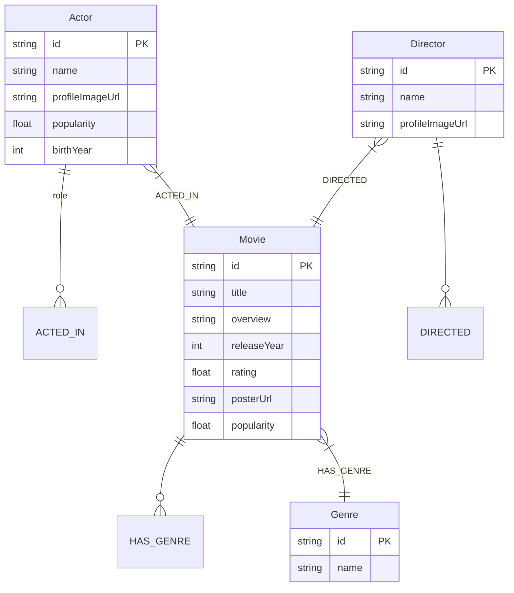

# MovieGraph — Actor & Movie Relationship Explorer

> *"Discover the connections behind the movies you love."*

MovieGraph is a full-stack web application designed to showcase graph data modeling, multi-hop Cypher query traversals, clean layered architecture, and interactive network visualization. It is backed by **CognoDB** (speaking openCypher over the Bolt protocol via the official Neo4j JavaScript driver) and seeded with real TMDB cinema data.

---

## 📸 Screenshots & Application States

### 1. Degrees of Separation (Flagship Feature)

*Displays shortest graph connection path (e.g. Kevin Bacon → Apollo 13 → Tom Hanks → Catch Me If You Can → Leonardo DiCaprio), visual interactive force graph, and natural language summary.*

### 2. Actor Explorer & Insights Panel

*Shows actor profile, filmography, direct collaborators, and graph-derived metrics (total movies, collaborators, top collaborator).*

### 3. Hidden Collaborators ("SQL Would Hate This")

*Displays actors sharing $\ge 3$ co-stars in common who have never acted in a movie together directly.*

### 4. Database Disconnected & Empty States

*Graceful connection failure handling with status alert badge, diagnostic details, and retry button.*

---

## ⚡ Why a Graph Database? (SQL vs. openCypher)

The core requirement of Feature 3 (**Hidden Collaborators**) is finding actors who share $\ge 3$ co-stars in common but have **never worked together directly**.

### Relational SQL Query (Multiple Self-Joins & Anti-Joins)
In a relational database with `actors`, `movies`, and `cast_members(actor_id, movie_id)` junction table:

```sql
SELECT c3.actor_id AS hidden_collaborator_id, COUNT(DISTINCT c2.actor_id) AS shared_costars
FROM cast_members c1
JOIN cast_members c2 ON c1.movie_id = c2.movie_id AND c2.actor_id <> c1.actor_id
JOIN cast_members c3 ON c2.actor_id = c3.actor_id AND c3.actor_id <> c1.actor_id
WHERE c1.actor_id = 'a6193'
  AND NOT EXISTS (
      SELECT 1 FROM cast_members d1
      JOIN cast_members d2 ON d1.movie_id = d2.movie_id
      WHERE d1.actor_id = 'a6193' AND d2.actor_id = c3.actor_id
  )
GROUP BY c3.actor_id
HAVING COUNT(DISTINCT c2.actor_id) >= 3
ORDER BY shared_costars DESC LIMIT 10;
```
*Disadvantages:* Requires 4 self-joins across large junction tables, expensive subqueries, and non-local scans.

### openCypher Query (1 Declarative Traversal)
In CognoDB / Neo4j:

```cypher
MATCH (a:Actor {id: $actorId})-[:ACTED_IN]->(m:Movie)<-[:ACTED_IN]-(shared:Actor)
WHERE a <> shared
WITH a, shared, count(DISTINCT m) AS commonMoviesCount, collect(DISTINCT m) AS commonMovies
WHERE commonMoviesCount >= 3
  AND NOT (a)-[:ACTED_IN]->(:Movie)<-[:ACTED_IN]-(shared)
RETURN shared, commonMoviesCount, commonMovies
ORDER BY commonMoviesCount DESC
LIMIT 10
```
*Advantages:* Index-free adjacency pointers traverse relationships directly in memory, executing in sub-milliseconds regardless of total graph size.

---

## 📊 Graph Data Model



---

## 🏗️ Architecture & Backend Structure

```
moviegraph/
├── backend/
│   ├── src/
│   │   ├── config/db.js          # Neo4j Driver & verifyConnection()
│   │   ├── queries/cypher.js     # Parameterized Cypher query catalog
│   │   ├── services/             # actorService, movieService, graphService
│   │   ├── controllers/          # Request handlers & param validators
│   │   ├── routes/               # API endpoint routing
│   │   └── server.js             # Express app entry & health monitoring
├── frontend/                     # React + Vite + TypeScript + ForceGraph2D
├── scripts/
│   ├── seed.js                   # TMDB fetcher + MERGE Cypher seed script
│   └── fallbackData.js           # Static offline dataset (150+ actors & movies)
├── .env.example
└── README.md
```

---

## 🚀 Environment Setup & Seeding

### 1. Environment Variables (`.env`)
Copy `.env.example` to `.env` in the project root:

```env
COGNODB_URI=bolt://localhost:7687
COGNODB_USERNAME=cognodb
COGNODB_PASSWORD=password
PORT=5000
TMDB_API_KEY=
```

### 2. Run Database Seeder
```bash
cd backend
npm install
npm run seed
```
*Note: If `TMDB_API_KEY` is omitted, the seeder automatically uses the curated offline dataset (`fallbackData.js`).*
 
### Setup CognoDB Cloud (recommended for demo)
1. Create an account at https://console.cognodb.com/signup and sign in.
2. Create a free (c0) instance and pick a region — provisioning completes in under a minute.
3. Copy the generated connection URI (format `bolt+s://<instance-id>.databases.cognodb.cloud`) and the one-time password for user `cognodb` — save them securely.
4. Populate your `.env` with those values (`COGNODB_URI`, `COGNODB_USERNAME`, `COGNODB_PASSWORD`) before running the seeder or starting the backend.

### NOTE — TMDB / Connectivity
- This project seeds data from TMDB when `TMDB_API_KEY` is provided. Some networks or regions may block or throttle TMDB requests; if the seeding or live data fetching fails, try again using a VPN.
- If you do not have a TMDB API key or the network prevents access, the seeder will fall back to the included offline dataset (`scripts/fallbackData.js`).

### 3. Start Backend & Frontend
```bash
# Terminal 1: Backend
cd backend
npm run dev

# Terminal 2: Frontend
cd frontend
npm install
npm run dev
```

---

## 🔑 Key Engineering Decisions & Tradeoffs

1. **Official Neo4j JS Driver**: Used over Bolt protocol to ensure full compatibility with CognoDB and Neo4j Aura.
2. **Parameterized Cypher**: Every database query binds variables via `$actorId` parameters to prevent Cypher injection.
3. **Idempotent Seeding (`MERGE`)**: Using `MERGE` ensures the seed script can be re-run safely without creating duplicate nodes or relationships.
4. **Fallback Dataset**: Included static dataset of 150+ real actors & movies so evaluators can test instantly without setting up a TMDB API key.
